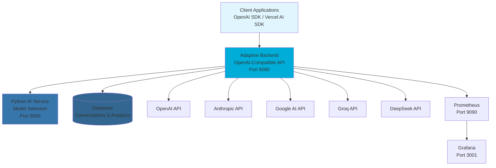

# Adaptive - Intelligent LLM Infrastructure

Supercharge your LLM workloads with intelligent model selection and cost optimization.

## What is Adaptive?

Adaptive automatically selects the optimal language model for each prompt using AI-powered analysis. Instead of manually choosing between GPT-4, Claude, Gemini, or other models, Adaptive intelligently routes your requests to the best model for each task.

## Key Benefits

- 🧠 **Smart Model Selection** - AI analyzes prompts and selects optimal models
- 💰 **Cost Optimization** - Route simple tasks to cheaper models
- ⚡ **OpenAI Compatible** - Drop-in replacement, just change the base URL
- 🔄 **Multi-Provider** - Access OpenAI, Anthropic, Groq, DeepSeek, Google AI
- 📊 **Usage Analytics** - Track spending and optimization opportunities

## Quick Start

### Use OpenAI SDK (Recommended)

```python
from openai import OpenAI

# Just point OpenAI SDK to Adaptive
client = OpenAI(
    api_key="your-adaptive-api-key",
    base_url="https://api.adaptive.ai/v1"
)

response = client.chat.completions.create(
    model="adaptive",  # Adaptive selects the best model
    messages=[{"role": "user", "content": "Explain quantum computing"}]
)
```

```javascript
import OpenAI from 'openai';

const client = new OpenAI({
  apiKey: 'your-adaptive-api-key',
  baseURL: 'https://api.adaptive.ai/v1'
});

const response = await client.chat.completions.create({
  model: 'adaptive',
  messages: [{ role: 'user', content: 'Write a Python function' }]
});
```

### Use Vercel AI SDK

```typescript
import { createOpenAI } from '@ai-sdk/openai';
import { generateText } from 'ai';

const adaptive = createOpenAI({
  apiKey: 'your-adaptive-api-key',
  baseURL: 'https://api.adaptive.ai/v1'
});

const { text } = await generateText({
  model: adaptive('adaptive'),
  prompt: 'Write a Python function to sort a list'
});
```

### Deploy with Docker

```bash
git clone https://github.com/your-org/adaptive.git
cd adaptive
cp .env.example .env
# Edit .env with your configuration
docker-compose up -d
```

## How It Works

1. **Prompt Analysis** - AI analyzes complexity, reasoning needs, and domain
2. **Model Selection** - Vector similarity matching finds optimal model
3. **Provider Routing** - Routes to selected provider (OpenAI, Anthropic, etc.)
4. **Response Conversion** - Converts all responses to OpenAI-compatible format

## Architecture



## Configuration

```bash
# Backend
OPENAI_API_KEY=sk-...
ANTHROPIC_API_KEY=sk-ant-...
GROQ_API_KEY=gsk_...
DEEPSEEK_API_KEY=sk-...
GOOGLE_AI_API_KEY=...

# Database
DB_SERVER=localhost
DB_NAME=adaptive
DB_USER=sa
DB_PASSWORD=your-password
```

## API Reference

All endpoints are OpenAI-compatible:

- `POST /v1/chat/completions` - Chat completions (with streaming)
- `GET /v1/models` - List available models

Response includes Adaptive metadata:
```json
{
  "choices": [...],
  "usage": {...},
  "adaptive": {
    "selected_provider": "openai",
    "match_score": 0.94,
    "cost_saved": 0.35
  }
}
```

## Development

```bash
# Backend (Go)
cd adaptive-backend
go run cmd/api/main.go

# AI Service (Python)
cd adaptive_ai
poetry install
poetry run python main.py

# Frontend (React)
cd adaptive-app
npm install
npm run dev
```

## License

Business Source License 1.1 - see [LICENSE](LICENSE) file for details.

**Summary**: Free for non-commercial use, commercial license required for production.

## Support

- **Documentation**: [docs.adaptive.ai](https://docs.adaptive.ai)
- **Issues**: [GitHub Issues](https://github.com/your-org/adaptive/issues)
- **Email**: support@adaptive.ai