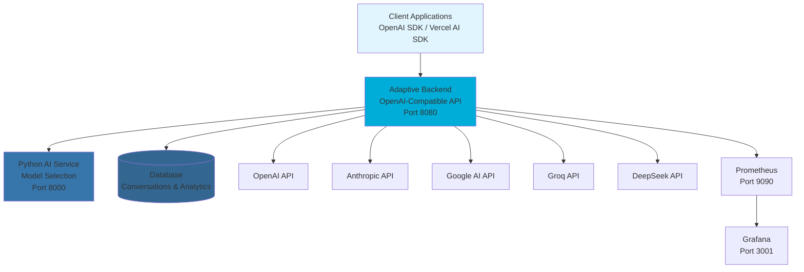

# Adaptive - Intelligent LLM Infrastructure

Supercharge your LLM workloads with intelligent model selection and cost optimization. Adaptive automatically selects the optimal language model for each prompt using AI-powered analysis, providing a unified OpenAI-compatible API across multiple providers.

## 🚀 What is Adaptive?

Adaptive is an intelligent LLM infrastructure platform that eliminates the need to manually choose between GPT-4, Claude, Gemini, or other models. Instead, Adaptive's AI analyzes your prompts and intelligently routes requests to the best model for each specific task, optimizing for both performance and cost.

### Key Benefits

- 🧠 **Smart Model Selection** - AI analyzes prompts and selects optimal models
- 💰 **Cost Optimization** - Route simple tasks to cheaper models automatically
- ⚡ **OpenAI Compatible** - Drop-in replacement, just change the base URL
- 🔄 **Multi-Provider** - Access OpenAI, Anthropic, Groq, DeepSeek, Google AI
- 📊 **Usage Analytics** - Track spending and optimization opportunities
- 🎯 **Domain Intelligence** - Specialized routing for code, writing, analysis
- 🔧 **Minion Orchestration** - Coordinate multiple specialized models

## 🏗️ Architecture



## 🚀 Quick Start

### 1. Deploy with Docker (Recommended)

```bash
# Clone the repository
git clone https://github.com/your-org/adaptive.git
cd adaptive

# Copy and configure environment variables
cp .env.example .env
# Edit .env with your API keys and configuration

# Start all services
docker-compose up -d
```

### 2. Use with OpenAI SDK

```python
from openai import OpenAI

# Point OpenAI SDK to Adaptive
client = OpenAI(
    api_key="your-adaptive-api-key",
    base_url="https://api.adaptive.ai/v1"
)

# Adaptive selects the best model automatically
response = client.chat.completions.create(
    model="adaptive",  # Adaptive selects the best model
    messages=[{"role": "user", "content": "Explain quantum computing"}]
)

print(response.choices[0].message.content)
```

### 3. Use with JavaScript/TypeScript

```javascript
import OpenAI from 'openai';

const client = new OpenAI({
  apiKey: 'your-adaptive-api-key',
  baseURL: 'https://api.adaptive.ai/v1'
});

const response = await client.chat.completions.create({
  model: 'adaptive',
  messages: [{ role: 'user', content: 'Write a Python function' }]
});
```

### 4. Use with Vercel AI SDK

```typescript
import { createOpenAI } from '@ai-sdk/openai';
import { generateText } from 'ai';

const adaptive = createOpenAI({
  apiKey: 'your-adaptive-api-key',
  baseURL: 'https://api.adaptive.ai/v1'
});

const { text } = await generateText({
  model: adaptive('adaptive'),
  prompt: 'Write a Python function to sort a list'
});
```

## 🔧 Configuration

### Environment Variables

```bash
# Provider API Keys (at least one required)
OPENAI_API_KEY=sk-...
ANTHROPIC_API_KEY=sk-ant-...
GROQ_API_KEY=gsk_...
DEEPSEEK_API_KEY=sk-...
GOOGLE_AI_API_KEY=...

# Database Configuration
DB_SERVER=localhost
DB_NAME=adaptive
DB_USER=sa
DB_PASSWORD=your-password

# Service URLs
AI_SERVICE_URL=http://localhost:8000
ADDR=:8080

# Frontend Configuration
CLERK_PUBLISHABLE_KEY=pk_test_...
CLERK_SECRET_KEY=sk_test_...
DATABASE_URL=postgresql://...
```

## 📡 API Reference

### Main Endpoint

**POST** `/v1/chat/completions` - Chat completions with intelligent model selection

```json
{
  "model": "adaptive",
  "messages": [
    {"role": "user", "content": "Explain quantum computing"}
  ],
  "stream": false,
  "provider_constraints": ["openai", "anthropic"],
  "cost_bias": 0.3
}
```

**Request Parameters:**
- `model`: Must be "adaptive" for intelligent routing
- `messages`: Array of conversation messages
- `stream`: Boolean for streaming responses
- `provider_constraints`: Array of allowed providers (optional)
- `cost_bias`: Float between 0-1 (optional, default: 0.5)
  - `0.0`: Maximum cost savings (prefer cheaper models)
  - `0.5`: Balanced approach (default)
  - `1.0`: Maximum performance (prefer best models regardless of cost)

### Response Format

```json
{
  "choices": [
    {
      "message": {
        "role": "assistant",
        "content": "Quantum computing is..."
      }
    }
  ],
  "usage": {
    "prompt_tokens": 10,
    "completion_tokens": 150,
    "total_tokens": 160
  },
  "adaptive": {
    "selected_provider": "openai",
    "selected_model": "gpt-4o",
    "match_score": 0.94,
    "cost_saved": 0.35,
    "reasoning": "Selected GPT-4o for complex reasoning task",
    "provider_constraints_used": ["openai", "anthropic"],
    "cost_bias_applied": 0.3
  }
}
```

### Usage Examples

#### Provider Constraints
```json
// OpenAI only
{
  "model": "adaptive",
  "messages": [{"role": "user", "content": "Hello"}],
  "provider_constraints": ["openai"]
}

// Multiple providers
{
  "model": "adaptive", 
  "messages": [{"role": "user", "content": "Hello"}],
  "provider_constraints": ["anthropic", "google"]
}
```

#### Cost Optimization
```json
// Cost-optimized (prefer cheaper models)
{
  "model": "adaptive",
  "messages": [{"role": "user", "content": "Simple question"}],
  "cost_bias": 0.1
}

// Performance-optimized (prefer best models)
{
  "model": "adaptive",
  "messages": [{"role": "user", "content": "Complex reasoning task"}],
  "cost_bias": 0.9
}
```

### Provider-Specific Endpoints

- `POST /v1/openai/chat/completions` - OpenAI-only models
- `POST /v1/anthropic/chat/completions` - Anthropic-only models
- `POST /v1/groq/chat/completions` - Groq-only models
- `POST /v1/deepseek/chat/completions` - DeepSeek-only models
- `POST /v1/gemini/chat/completions` - Google AI-only models

## 🧠 How It Works

### 1. Prompt Analysis
Adaptive's AI service analyzes each prompt across multiple dimensions:
- **Complexity**: Simple vs. complex reasoning requirements
- **Domain**: Code, writing, analysis, creative tasks
- **Context**: Length and context requirements
- **Creativity**: Creative vs. factual content needs

### 2. Model Selection
Using vector similarity matching and domain classification, Adaptive selects the optimal model based on:
- Task requirements and complexity
- Model capabilities and performance
- Cost considerations
- Provider availability

### 3. Provider Routing
Requests are routed to the selected provider while maintaining OpenAI-compatible response format.

### 4. Response Conversion
All provider responses are converted to a unified OpenAI-compatible format with Adaptive metadata.

## 🏛️ Project Structure

```
adaptive/
├── adaptive-backend/          # Go API server (OpenAI-compatible)
├── adaptive_ai/              # Python AI service (model selection)
├── adaptive-app/             # Next.js frontend (web interface)
├── monitoring/               # Prometheus & Grafana setup
├── benchmarks/               # Performance testing tools
├── minions/                  # Specialized model orchestration
├── analysis/                 # Cost and performance analysis
└── docker-compose.yml        # Full stack deployment
```

## 🛠️ Development

### Prerequisites

- Docker and Docker Compose
- Go 1.21+ (for backend development)
- Python 3.11+ (for AI service development)
- Node.js 18+ (for frontend development)

### Local Development

```bash
# Backend (Go)
cd adaptive-backend
go mod tidy
go run cmd/api/main.go

# AI Service (Python)
cd adaptive_ai
uv venv
uv sync
uv run python adaptive_ai/main.py

# Frontend (Next.js)
cd adaptive-app
bun install
bun run dev
```

### Testing

```bash
# Backend tests
cd adaptive-backend
go test ./...

# AI service tests
cd adaptive_ai
uv run pytest

# Frontend tests
cd adaptive-app
bun run test
```

## 📊 Monitoring & Analytics

Adaptive includes comprehensive monitoring:

- **Prometheus**: Metrics collection
- **Grafana**: Dashboards and visualization
- **Cost Tracking**: Per-request cost analysis
- **Performance Metrics**: Response times and throughput
- **Model Selection Analytics**: Selection patterns and effectiveness

## 🔒 Security

- API key authentication and management
- Request rate limiting
- Secure provider communication
- Data encryption in transit
- Audit logging for compliance

## 📈 Performance

- **Latency**: <100ms model selection overhead
- **Throughput**: 1000+ requests/second
- **Availability**: 99.9% uptime target
- **Cost Savings**: 30-70% typical reduction

## 🤝 Contributing

We welcome contributions! Please see our [Contributing Guidelines](CONTRIBUTING.md) for details.

### Development Workflow

1. Fork the repository
2. Create a feature branch
3. Make your changes
4. Add tests
5. Submit a pull request

## 📄 License

Business Source License 1.1 - see [LICENSE](LICENSE) file for details.

**Summary**: Free for non-commercial use, commercial license required for production.

## 🆘 Support

- **Documentation**: [docs.adaptive.ai](https://docs.adaptive.ai)
- **Issues**: [GitHub Issues](https://github.com/your-org/adaptive/issues)
- **Email**: support@adaptive.ai
- **Discord**: [Community Server](https://discord.gg/adaptive)

## 🗺️ Roadmap

- [ ] Additional LLM providers (Cohere, Mistral, etc.)
- [ ] Advanced minion orchestration
- [ ] Custom model fine-tuning
- [ ] Enterprise features (SSO, RBAC)
- [ ] Mobile SDKs
- [ ] Edge deployment options

---

**Made with ❤️ by the Adaptive team**