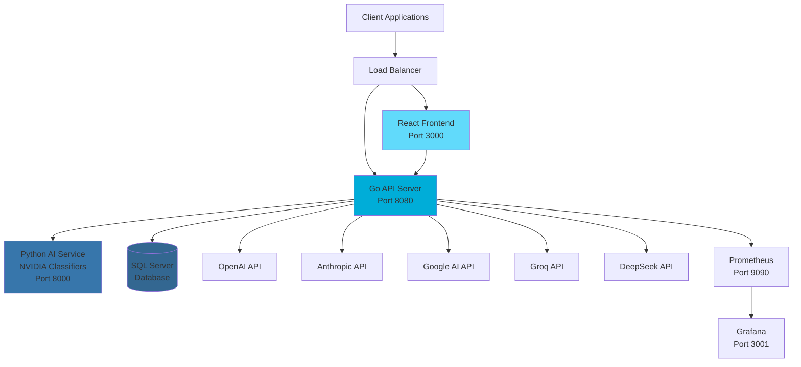

<div align="center">

# 🚀 Adaptive - Intelligent LLM Infrastructure

[](https://opensource.org/licenses/MIT)
[](https://www.docker.com/)
[](https://golang.org/)
[](https://reactjs.org/)
[](https://python.org/)

*Supercharge your LLM workloads with intelligent model selection and cost optimization*

[🌟 Features](#-features) • [🚀 Quick Start](#-quick-start) • [📖 Documentation](#-documentation) • [🏗️ Architecture](#️-architecture) • [🤝 Contributing](#-contributing)

</div>

---

## 🎯 What is Adaptive?

Adaptive is an **AI-powered LLM infrastructure platform** that automatically selects the optimal language model for each prompt based on intelligent analysis. Instead of manually choosing between GPT-4, Claude, Gemini, or other models, Adaptive uses NVIDIA-powered machine learning classifiers to:

- 🧠 **Analyze prompt complexity** across multiple dimensions
- 🎯 **Select the best model** for each specific task
- 💰 **Optimize costs** by routing simple prompts to cheaper models
- ⚡ **Maximize performance** by using powerful models only when needed
- 📊 **Provide insights** into usage patterns and cost savings

### The Problem We Solve

```python
# Before: Manual model selection and cost management
openai_client = OpenAI()
anthropic_client = Anthropic()
groq_client = Groq()

# Which model should I use? 🤔
# - GPT-4o for complex reasoning?
# - Claude for writing tasks?
# - Groq for speed?
# - How much will this cost?

response = openai_client.chat.completions.create(
    model="gpt-4o",  # Always expensive, might be overkill
    messages=[{"role": "user", "content": prompt}],
    temperature=0.7
)
```

```python
# After: Intelligent automatic selection
from adaptive import Adaptive

adaptive = Adaptive(api_key="your-key")

# Adaptive automatically:
# ✅ Analyzes your prompt
# ✅ Selects the optimal model
# ✅ Optimizes parameters
# ✅ Saves you money

response = adaptive.chat.completions.create(
    messages=[{"role": "user", "content": prompt}],
    # That's it! No model selection needed
)
```

---

## 🌟 Features

### 🤖 Intelligent Model Selection
- **NVIDIA-Powered Analysis**: Advanced NVIDIA classifiers analyze prompts across creativity, reasoning, context, and domain knowledge
- **Multi-Provider Support**: Go service manages connections to OpenAI, Anthropic, Google AI, Groq, DeepSeek
- **Vector Similarity Matching**: Cosine similarity algorithms match prompts to optimal models
- **Domain-Specific Routing**: Specialized model selection for code, writing, analysis, etc.

### 💰 Cost Optimization
- **Smart Model Routing**: Route simple tasks to cost-effective models
- **Parameter Optimization**: Automatically adjust temperature, top-p, and other parameters
- **Usage Analytics**: Track spending and identify optimization opportunities
- **Real-time Cost Tracking**: Monitor expenses across all providers

### 🏗️ Enterprise-Ready Infrastructure
- **Scalable Architecture**: Microservices design with Docker deployment
- **Monitoring & Observability**: Prometheus metrics and Grafana dashboards
- **Authentication & Security**: Clerk-based auth with API key management
- **High Availability**: Health checks and automatic restarts
- **Rate Limiting**: Built-in protection against abuse

### 🛠️ Developer Experience
- **Multiple SDKs**: Python, JavaScript/TypeScript client libraries
- **OpenAI-Compatible API**: Go service provides drop-in replacement for existing code
- **Streaming Support**: Real-time response streaming through Go API
- **Conversation Management**: Full chat history and context management
- **Rich Documentation**: Comprehensive guides and examples

---

## 🚀 Quick Start

### Option 1: Docker Compose (Recommended)

```bash
# Clone the repository
git clone https://github.com/your-org/adaptive.git
cd adaptive

# Set up environment variables
cp .env.example .env
# Edit .env with your configuration

# Start all services
docker-compose up -d

# Access the application
open http://localhost:3000
```

### Option 2: Development Setup

```bash
# Backend (Go)
cd adaptive-backend
go mod tidy
go run cmd/api/main.go

# Frontend (React)
cd adaptive-frontend
pnpm install
pnpm dev

# AI Service (Python)
cd adaptive_ai
poetry install
poetry run python main.py
```

### Option 3: Using the Client Libraries

**Python:**
```bash
pip install adaptive-python
```

```python
from adaptive import Adaptive

client = Adaptive(api_key="your-api-key")

response = client.chat.completions.create(
    messages=[
        {"role": "user", "content": "Explain quantum computing"}
    ]
)

print(response.choices[0].message.content)
```

**JavaScript/TypeScript:**
```bash
npm install adaptive-js
```

```typescript
import { Adaptive } from 'adaptive-js';

const client = new Adaptive({ apiKey: 'your-api-key' });

const response = await client.chat.completions.create({
  messages: [
    { role: 'user', content: 'Write a Python function to sort a list' }
  ]
});

console.log(response.choices[0].message.content);
```

---

## 🏗️ Architecture



### Components

| Component | Technology | Purpose |
|-----------|------------|---------|
| **Frontend** | React 19, TypeScript, TanStack Router | User interface and dashboard |
| **Backend API** | Go, Fiber, GORM | Model provider integration, authentication, data management |
| **AI Service** | Python, LitServe, NVIDIA classifiers | Model selection and prompt analysis |
| **Database** | SQL Server | User data, conversations, analytics |
| **Monitoring** | Prometheus, Grafana | Metrics, alerts, observability |
| **Client SDKs** | Python, JavaScript | Easy integration libraries |

---

## 📊 How It Works

### 1. Prompt Analysis
```python
# Input prompt is analyzed across multiple dimensions:
{
    "creativity_scope": 0.8,      # How creative should the response be?
    "reasoning": 0.9,             # How much logical reasoning is needed?
    "contextual_knowledge": 0.6,  # How much context understanding is required?
    "domain_knowledge": 0.7       # How specialized is the domain?
}
```

### 2. Model Selection
```python
# Vector similarity matching finds the optimal model:
{
    "selected_model": "gpt-4o",
    "provider": "openai",
    "match_score": 0.94,
    "domain": "technical_writing"
}
```

### 3. Parameter Optimization
```python
# Parameters are automatically tuned:
{
    "temperature": 0.7,
    "top_p": 0.9,
    "max_tokens": 2048,
    "frequency_penalty": 0.0
}
```

---

## 🛠️ Configuration

### Environment Variables

```bash
# Backend Configuration
ADDR=:8080
ALLOWED_ORIGINS=http://localhost:3000
DB_SERVER=localhost
DB_NAME=adaptive
DB_USER=sa
DB_PASSWORD=your-password

# Authentication
CLERK_SECRET_KEY=your-clerk-secret
STRIPE_SECRET_KEY=your-stripe-secret

# AI Service
OPENAI_API_KEY=your-openai-key
ANTHROPIC_API_KEY=your-anthropic-key
GOOGLE_AI_API_KEY=your-google-key
GROQ_API_KEY=your-groq-key
DEEPSEEK_API_KEY=your-deepseek-key

# Frontend
VITE_CLERK_PUBLISHABLE_KEY=your-clerk-public-key
VITE_BASE_API_URL=http://localhost:8080
```

### Model Configuration

Add or modify models in `adaptive_ai/models/llms.py`:

```python
model_capabilities = {
    "custom-model": {
        "provider": "custom",
        "capability_vector": [0.8, 0.9, 0.7, 0.8],  # [creativity, reasoning, context, domain]
        "cost_per_token": 0.00001,
        "max_tokens": 4096
    }
}
```

---

## 📖 API Reference

### Chat Completions

**Endpoint:** `POST /api/chat/completions`

```json
{
  "messages": [
    {"role": "user", "content": "Your prompt here"}
  ],
  "stream": false,
  "max_tokens": 2048
}
```

**Response:**
```json
{
  "id": "chatcmpl-123",
  "object": "chat.completion",
  "created": 1677652288,
  "model": "gpt-4o",
  "provider": "openai",
  "match_score": 0.94,
  "choices": [
    {
      "index": 0,
      "message": {
        "role": "assistant",
        "content": "Response here..."
      },
      "finish_reason": "stop"
    }
  ],
  "usage": {
    "prompt_tokens": 9,
    "completion_tokens": 12,
    "total_tokens": 21
  }
}
```

### Streaming

```bash
curl -X POST http://localhost:8080/api/chat/completions/stream \
  -H "Authorization: Bearer your-api-key" \
  -H "Content-Type: application/json" \
  -d '{"messages": [{"role": "user", "content": "Hello!"}], "stream": true}'
```

---

## 🔧 Development

### Prerequisites

- **Go** 1.24+
- **Node.js** 18+
- **Python** 3.12+
- **Docker** and **Docker Compose**
- **pnpm** (for frontend)
- **Poetry** (for Python dependencies)

### Setup Development Environment

```bash
# Install dependencies
make install

# Start development servers
make dev

# Run tests
make test

# Build for production
make build

# Deploy with Docker
make deploy
```

### Project Structure

```
adaptive/
├── adaptive-backend/       # Go API server
│   ├── cmd/api/           # Application entry point
│   ├── internal/          # Internal packages
│   └── config/            # Configuration
├── adaptive-frontend/      # React application
│   ├── src/               # Source code
│   ├── components/        # UI components
│   └── pages/             # Application pages
├── adaptive_ai/           # Python AI service
│   ├── services/          # Business logic
│   ├── models/            # ML models and data
│   └── core/              # Core utilities
├── libraries/             # Client SDKs
│   ├── adaptive-python/   # Python SDK
│   └── adaptive-js/       # JavaScript SDK
├── monitoring/            # Monitoring configuration
└── docker-compose.yml    # Docker orchestration
```

---

## 🧪 Testing

### Backend Tests
```bash
cd adaptive-backend
go test ./...
```

### Frontend Tests
```bash
cd adaptive-frontend
pnpm test
```

### AI Service Tests
```bash
cd adaptive_ai
poetry run pytest
```

### Integration Tests
```bash
docker-compose -f docker-compose.test.yml up --abort-on-container-exit
```

---

## 📈 Monitoring

### Prometheus Metrics
- Request latency and throughput
- Model selection accuracy
- Cost tracking per model/provider
- Error rates and health status

### Grafana Dashboards
- **System Overview**: Infrastructure health and performance
- **Cost Analytics**: Spending breakdown and optimization opportunities
- **Model Performance**: Selection accuracy and response quality
- **User Analytics**: Usage patterns and popular features

Access Grafana at `http://localhost:3001` (admin/admin)

---

## 🚀 Deployment

### Production Deployment

```bash
# Build and deploy with Docker
docker-compose -f docker-compose.prod.yml up -d

# Or deploy to Kubernetes
kubectl apply -f k8s/
```

### Scaling

```yaml
# docker-compose.prod.yml
services:
  backend-go:
    deploy:
      replicas: 3
  backend-python:
    deploy:
      replicas: 2
```

### Environment-Specific Configs

- **Development**: `docker-compose.yml`
- **Staging**: `docker-compose.staging.yml`
- **Production**: `docker-compose.prod.yml`

---

## 🤝 Contributing

We welcome contributions! Please see our [Contributing Guide](CONTRIBUTING.md) for details.

### Quick Contribution Steps

1. **Fork** the repository
2. **Create** a feature branch (`git checkout -b feature/amazing-feature`)
3. **Commit** your changes (`git commit -m 'Add amazing feature'`)
4. **Push** to the branch (`git push origin feature/amazing-feature`)
5. **Open** a Pull Request

### Development Guidelines

- Follow the established coding standards
- Add tests for new features
- Update documentation as needed
- Ensure all tests pass before submitting

---

## 📄 License

This project is licensed under the MIT License - see the [LICENSE](LICENSE) file for details.

---

## 🙏 Acknowledgments

- **OpenAI, Anthropic, Google, Groq, DeepSeek** for their amazing LLM APIs
- **The open-source community** for the incredible tools and libraries
- **Our contributors** who make this project possible

---

## 📞 Support

- **Documentation**: [docs.adaptive.ai](https://docs.adaptive.ai)
- **Discord Community**: [Join our Discord](https://discord.gg/adaptive)
- **Email Support**: support@adaptive.ai
- **GitHub Issues**: [Report bugs or request features](https://github.com/your-org/adaptive/issues)

---

<div align="center">

**[⭐ Star us on GitHub](https://github.com/your-org/adaptive)** • **[🐦 Follow us on Twitter](https://twitter.com/adaptive_ai)** • **[💼 Visit our website](https://adaptive.ai)**

Made with ❤️ by the Adaptive team

</div>
