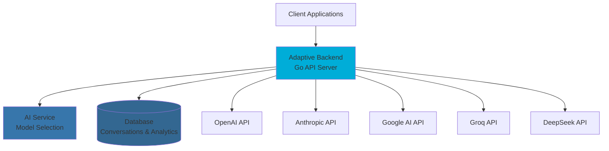
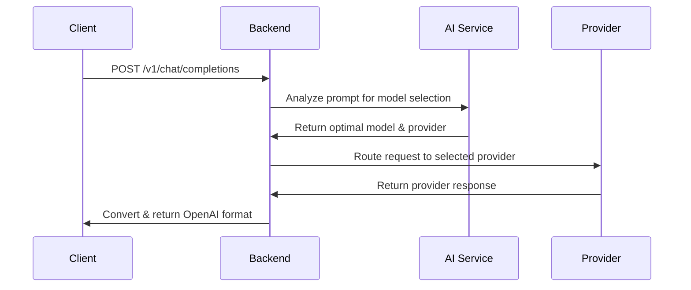

# Adaptive Backend

OpenAI-compatible API server that provides intelligent LLM routing through a familiar interface. Built with Go for high performance and reliability.

## 🚀 Overview

The Adaptive Backend is a high-performance Go server that acts as a unified gateway to multiple LLM providers. It maintains full OpenAI API compatibility while adding intelligent model selection capabilities.

### Key Features

- **OpenAI Compatible** - Drop-in replacement, just change the base URL
- **Smart Routing** - AI service selects optimal model for each prompt
- **Multi-Provider** - OpenAI, Anthropic, Groq, DeepSeek, Google AI
- **Unified Streaming** - Converts all provider responses to OpenAI format
- **Cost Optimization** - Routes to cheaper models when appropriate
- **High Performance** - Built with Go for low latency and high throughput
- **Production Ready** - Health checks, metrics, logging, and monitoring

## 🏗️ Architecture



## 🚀 Quick Start

### Prerequisites

- Go 1.21+
- PostgreSQL database
- API keys for at least one provider

### Installation

```bash
# Clone the repository
git clone https://github.com/your-org/adaptive.git
cd adaptive-backend

# Install dependencies
go mod tidy

# Set environment variables
cp .env.example .env.local
# Edit .env.local with your configuration

# Run server
go run cmd/api/main.go
```

### Docker Deployment

```bash
# Build and run with Docker
docker build -t adaptive-backend .
docker run -p 8080:8080 --env-file .env.local adaptive-backend
```

## 🔧 Configuration

### Environment Variables

```bash
# Provider API Keys (at least one required)
OPENAI_API_KEY=sk-...
ANTHROPIC_API_KEY=sk-ant-...
GROQ_API_KEY=gsk_...
DEEPSEEK_API_KEY=sk-...
GOOGLE_AI_API_KEY=...

# Database Configuration
DB_SERVER=localhost
DB_NAME=adaptive
DB_USER=sa
DB_PASSWORD=your-password
DB_PORT=5432
DB_SSL_MODE=disable

# Service URLs
AI_SERVICE_URL=http://localhost:8000
ADDR=:8080

# Logging
LOG_LEVEL=info
LOG_FORMAT=json

# Rate Limiting
RATE_LIMIT_REQUESTS=1000
RATE_LIMIT_WINDOW=1m

# Security
JWT_SECRET=your-jwt-secret
API_KEY_HEADER=X-API-Key
```

## 📡 API Reference

### OpenAI-Compatible Endpoints

#### Main Chat Completions

**POST** `/v1/chat/completions`

Routes across all providers for optimal model selection with configurable constraints.

```json
{
  "model": "adaptive",
  "messages": [{ "role": "user", "content": "Explain quantum computing" }],
  "stream": false,
  "temperature": 0.7,
  "max_tokens": 1000,
  "provider_constraints": ["openai", "anthropic"],
  "cost_bias": 0.3
}
```

**Request Parameters:**

- `model`: Must be "adaptive" for intelligent routing
- `messages`: Array of conversation messages
- `stream`: Boolean for streaming responses
- `provider_constraints`: Array of allowed providers (optional)
- `cost_bias`: Float between 0-1 (optional, default: 0.5)
  - `0.0`: Maximum cost savings (prefer cheaper models)
  - `0.5`: Balanced approach (default)
  - `1.0`: Maximum performance (prefer best models regardless of cost)

**Response:**

```json
{
  "choices": [
    {
      "message": {
        "role": "assistant",
        "content": "Quantum computing is..."
      },
      "finish_reason": "stop",
      "index": 0
    }
  ],
  "usage": {
    "prompt_tokens": 10,
    "completion_tokens": 150,
    "total_tokens": 160
  },
  "adaptive": {
    "selected_provider": "openai",
    "selected_model": "gpt-4o",
    "match_score": 0.94,
    "cost_saved": 0.35,
    "reasoning": "Selected GPT-4o for complex reasoning task",
    "provider_constraints_used": ["openai", "anthropic"],
    "cost_bias_applied": 0.3
  }
}
```

#### Streaming Chat Completions

**POST** `/v1/chat/completions` with `"stream": true`

```json
{
  "model": "adaptive",
  "messages": [{ "role": "user", "content": "Write a story" }],
  "stream": true,
  "provider_constraints": ["openai"],
  "cost_bias": 0.8
}
```

Returns Server-Sent Events (SSE) format:

```
data: {"choices":[{"delta":{"content":"Once"},"index":0}]}

data: {"choices":[{"delta":{"content":" upon"},"index":0}]}

data: {"choices":[{"delta":{"content":" a time"},"index":0}]}

data: [DONE]
```

#### List Models

**GET** `/v1/models`

Returns available models across all providers.

```json
{
  "data": [
    {
      "id": "gpt-4o",
      "object": "model",
      "created": 1640995200,
      "owned_by": "openai"
    },
    {
      "id": "claude-3-opus",
      "object": "model",
      "created": 1640995200,
      "owned_by": "anthropic"
    }
  ],
  "object": "list"
}
```

### Provider Constraints Examples

#### OpenAI Only

```json
{
  "model": "adaptive",
  "messages": [{ "role": "user", "content": "Hello" }],
  "provider_constraints": ["openai"]
}
```

#### Anthropic and Google AI Only

```json
{
  "model": "adaptive",
  "messages": [{ "role": "user", "content": "Hello" }],
  "provider_constraints": ["anthropic", "google"]
}
```

#### Cost-Optimized Selection

```json
{
  "model": "adaptive",
  "messages": [{ "role": "user", "content": "Simple question" }],
  "cost_bias": 0.1
}
```

#### Performance-Optimized Selection

```json
{
  "model": "adaptive",
  "messages": [{ "role": "user", "content": "Complex reasoning task" }],
  "cost_bias": 0.9
}
```

### Management Endpoints

#### Conversations

**GET** `/api/conversations` - List conversations
**POST** `/api/conversations` - Create conversation
**GET** `/api/conversations/{id}` - Get conversation
**PUT** `/api/conversations/{id}` - Update conversation
**DELETE** `/api/conversations/{id}` - Delete conversation

#### API Keys

**GET** `/api/api_keys/{userId}` - List API keys for user
**POST** `/api/api_keys` - Create new API key
**DELETE** `/api/api_keys/{keyId}` - Delete API key

#### Health Check

**GET** `/health` - Service health status

```json
{
  "status": "healthy",
  "timestamp": "2024-01-01T00:00:00Z",
  "version": "1.0.0",
  "services": {
    "database": "healthy",
    "ai_service": "healthy"
  }
}
```

## 🧠 How It Works

### Request Flow

1. **Request Reception** - Receives OpenAI-compatible request
2. **Authentication** - Validates API key and user permissions
3. **Model Selection** - Sends prompt to AI service for optimal model selection
4. **Provider Routing** - Routes request to selected provider
5. **Response Conversion** - Converts provider response to OpenAI format
6. **Metadata Addition** - Adds Adaptive selection metadata
7. **Response Return** - Returns unified response to client

### Model Selection Process



## 🏛️ Project Structure

```
adaptive-backend/
├── cmd/
│   └── api/
│       └── main.go              # Application entry point
├── internal/
│   ├── api/                     # HTTP handlers and routes
│   │   ├── chat/               # Chat completion handlers
│   │   ├── models/             # Model listing handlers
│   │   ├── conversations/      # Conversation management
│   │   └── api_keys/           # API key management
│   ├── middleware/             # HTTP middleware
│   │   ├── auth.go            # Authentication middleware
│   │   ├── cors.go            # CORS handling
│   │   ├── logging.go         # Request logging
│   │   └── rate_limit.go      # Rate limiting
│   ├── models/                # Data models and structs
│   │   ├── chat.go           # Chat request/response models
│   │   ├── conversation.go   # Conversation models
│   │   └── api_key.go        # API key models
│   ├── services/             # Business logic
│   │   ├── providers/        # LLM provider implementations
│   │   │   ├── openai/       # OpenAI provider
│   │   │   ├── anthropic/    # Anthropic provider
│   │   │   ├── groq/         # Groq provider
│   │   │   ├── deepseek/     # DeepSeek provider
│   │   │   └── google/       # Google AI provider
│   │   ├── stream_readers/   # Response conversion utilities
│   │   ├── chat_service.go   # Chat orchestration logic
│   │   └── ai_service.go     # AI service communication
│   ├── repositories/         # Data access layer
│   │   ├── conversation.go   # Conversation data access
│   │   └── api_key.go        # API key data access
│   └── config/               # Configuration management
│       └── config.go         # Environment configuration
├── pkg/                      # Public packages
│   └── utils/                # Utility functions
├── go.mod                    # Go module definition
├── go.sum                    # Dependency checksums
├── Dockerfile                # Docker build configuration
└── README.md                 # This file
```

## 🛠️ Development

### Local Development

```bash
# Install dependencies
go mod tidy

# Run with hot reload (requires air)
go install github.com/cosmtrek/air@latest
air

# Run tests
go test ./...

# Run with race detection
go test -race ./...

# Run benchmarks
go test -bench=. ./...
```

### Building

```bash
# Development build
go build -o bin/adaptive-backend cmd/api/main.go

# Production build
CGO_ENABLED=0 GOOS=linux go build -a -installsuffix cgo -o bin/adaptive-backend cmd/api/main.go

# Docker build
docker build -t adaptive-backend .
```

### Testing

```bash
# Run all tests
go test ./...

# Run tests with coverage
go test -cover ./...

# Run specific test
go test ./internal/services/providers/openai

# Run integration tests
go test -tags=integration ./...
```

## 📊 Monitoring & Observability

### Health Checks

- **Readiness**: `/health` - Service is ready to accept requests
- **Liveness**: `/health/live` - Service is running and healthy
- **Startup**: `/health/startup` - Service has completed startup

### Metrics

Prometheus metrics are exposed at `/metrics`:

- `adaptive_requests_total` - Total requests processed
- `adaptive_request_duration_seconds` - Request duration histogram
- `adaptive_provider_requests_total` - Requests per provider
- `adaptive_model_selections_total` - Model selection counts
- `adaptive_errors_total` - Error counts by type

### Logging

Structured JSON logging with configurable levels:

```json
{
  "level": "info",
  "timestamp": "2024-01-01T00:00:00Z",
  "message": "Request processed",
  "request_id": "req_123",
  "provider": "openai",
  "model": "gpt-4o",
  "duration_ms": 1250,
  "tokens_used": 160
}
```

## 🔒 Security

### Authentication

- API key-based authentication
- JWT token validation for web interface
- Rate limiting per API key
- Request signing for sensitive operations

### Data Protection

- All data encrypted in transit (TLS)
- Sensitive data encrypted at rest
- API keys hashed in database
- Audit logging for all operations

### Rate Limiting

- Configurable rate limits per API key
- Burst protection
- Automatic backoff for exceeded limits

## 📈 Performance

### Benchmarks

- **Latency**: <50ms p95 for model selection
- **Throughput**: 2000+ requests/second
- **Memory**: <100MB typical usage
- **CPU**: <10% under normal load

### Optimization

- Connection pooling for database and external APIs
- Response streaming for large completions
- Efficient JSON parsing and serialization
- Memory-efficient request handling

## 🚀 Deployment

### Docker

```bash
# Build image
docker build -t adaptive-backend .

# Run container
docker run -d \
  --name adaptive-backend \
  -p 8080:8080 \
  --env-file .env.local \
  adaptive-backend
```

### Kubernetes

```yaml
apiVersion: apps/v1
kind: Deployment
metadata:
  name: adaptive-backend
spec:
  replicas: 3
  selector:
    matchLabels:
      app: adaptive-backend
  template:
    metadata:
      labels:
        app: adaptive-backend
    spec:
      containers:
        - name: adaptive-backend
          image: adaptive-backend:latest
          ports:
            - containerPort: 8080
          env:
            - name: DB_SERVER
              valueFrom:
                secretKeyRef:
                  name: adaptive-secrets
                  key: db-server
          livenessProbe:
            httpGet:
              path: /health
              port: 8080
            initialDelaySeconds: 30
            periodSeconds: 10
          readinessProbe:
            httpGet:
              path: /health
              port: 8080
            initialDelaySeconds: 5
            periodSeconds: 5
```

### Environment Variables

See the [Configuration](#configuration) section for all available environment variables.

## 🤝 Contributing

We welcome contributions! Please see our [Contributing Guidelines](../../CONTRIBUTING.md) for details.

### Development Workflow

1. Fork the repository
2. Create a feature branch (`git checkout -b feature/amazing-feature`)
3. Make your changes
4. Add tests for new functionality
5. Run tests and ensure they pass
6. Commit your changes (`git commit -m 'Add amazing feature'`)
7. Push to the branch (`git push origin feature/amazing-feature`)
8. Open a Pull Request

### Code Style

- Follow Go conventions and idioms
- Use `gofmt` for code formatting
- Run `golint` and `govet` before committing
- Write tests for new functionality
- Update documentation for API changes

## 📄 License

This project is licensed under the Business Source License 1.1 - see the [LICENSE](../../LICENSE) file for details.

## 🆘 Support

- **Issues**: [GitHub Issues](https://github.com/your-org/adaptive/issues)
- **Documentation**: [docs.adaptive.ai](https://docs.adaptive.ai)
- **Email**: support@adaptive.ai
- **Discord**: [Community Server](https://discord.gg/adaptive)

---

**Made with ❤️ by the Adaptive team**
