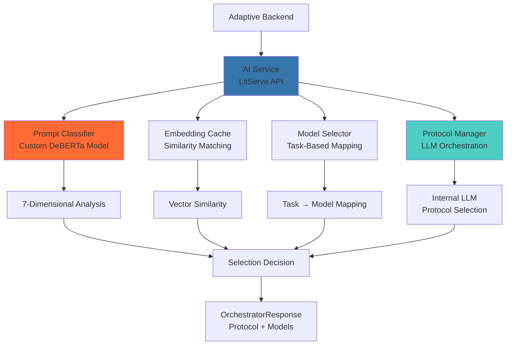
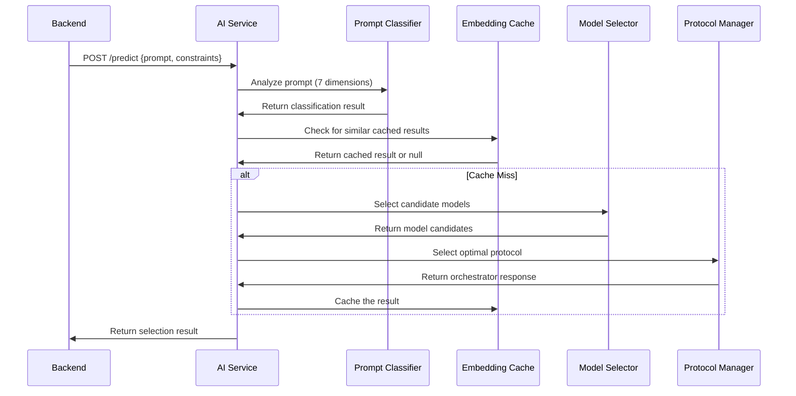

# Adaptive AI Service

Python ML service that intelligently selects optimal LLM models based on prompt analysis. Built with LitServe for high-performance inference and modern Python tooling.

## 🚀 Overview

The Adaptive AI Service is the brain of the Adaptive platform, responsible for analyzing prompts and selecting the optimal language model for each request. It uses advanced ML techniques including multi-dimensional prompt classification, task-specific model mapping, and intelligent protocol selection to make optimal routing decisions.

### Key Features

- **Multi-Dimensional Prompt Classification**: Analyzes prompts across 7 dimensions (creativity, reasoning, context, domain, etc.)
- **Task-Specific Model Selection**: Maps tasks to optimal models based on task type
- **Provider Constraints**: Supports filtering by specific providers
- **Cost Bias Control**: Configurable cost vs. performance trade-offs
- **Protocol Selection**: Supports standard_llm, minion, and minions_protocol
- **High Performance**: LitServe for fast batch inference
- **Embedding Cache**: Intelligent caching for similar prompts
- **Comprehensive Model Catalog**: 50+ models across 7 providers

## 🏗️ Architecture



## 🚀 Quick Start

### Prerequisites

- Python 3.11+
- uv package manager
- Hugging Face token (for model downloads)
- At least 8GB RAM (for model loading)

### Installation

```bash
# Install uv (if you don't have it)
pip install uv

# Clone the repository
git clone https://github.com/your-org/adaptive.git
cd adaptive_ai

# Create virtual environment and install dependencies
uv venv
uv sync

# Set environment variables
cp .env.example .env.local
# Edit .env.local with your configuration

# Run service
uv run python adaptive_ai/main.py
```

### Docker Deployment

```bash
# Build image
docker build -t adaptive-ai .

# Run container
docker run -d \
  --name adaptive-ai \
  -p 8000:8000 \
  --env-file .env.local \
  adaptive-ai
```

## 🔧 Configuration

### Environment Variables

```bash
# Hugging Face Configuration
HUGGINGFACE_TOKEN=hf_xxxxx
HF_HOME=/path/to/cache  # Optional: specify cache directory

# Service Configuration
ADAPTIVE_AI_ENVIRONMENT=production
ADAPTIVE_AI_LOG_LEVEL=INFO
ADAPTIVE_AI_HOST=0.0.0.0
ADAPTIVE_AI_PORT=8000

# LitServe Configuration
LITSERVE_MAX_BATCH_SIZE=10
LITSERVE_BATCH_TIMEOUT=1.0
LITSERVE_ACCELERATOR=cpu  # or gpu
LITSERVE_DEVICES=1

# Embedding Cache Configuration
EMBEDDING_CACHE_MODEL_NAME=sentence-transformers/all-MiniLM-L6-v2
EMBEDDING_CACHE_SIMILARITY_THRESHOLD=0.95

# Model Configuration
MODEL_CACHE_DIR=/app/models
ENABLE_QUANTIZATION=true
MAX_CONCURRENT_REQUESTS=10
```

## 📡 API Reference

### Model Selection Endpoint

**POST** `/predict`

Analyzes a prompt and returns the optimal model selection strategy.

#### Request

```json
{
  "prompt": "Write a Python function to sort a list",
  "user_id": "user123",
  "provider_constraint": ["openai", "anthropic"],
  "cost_bias": 0.3
}
```

**Request Parameters:**
- `prompt`: The input prompt to analyze
- `user_id`: Optional user identifier for tracking
- `provider_constraint`: Array of allowed providers (optional)
- `cost_bias`: Float between 0-1 (optional, default: 0.5)
  - `0.0`: Maximum cost savings
  - `0.5`: Balanced approach
  - `1.0`: Maximum performance

#### Response Formats

The response structure varies based on the selected protocol:

##### Standard LLM Protocol

For tasks requiring a single large language model:

```json
{
  "protocol": "standard_llm",
  "standard": {
    "provider": "openai",
    "model": "gpt-4o",
    "parameters": {
      "temperature": 0.7,
      "top_p": 0.9,
      "max_tokens": 512,
      "n": 1,
      "stop": null,
      "frequency_penalty": 0.0,
      "presence_penalty": 0.0
    },
    "alternatives": [
      {
        "provider": "google",
        "model": "gemini-2.5-pro"
      },
      {
        "provider": "anthropic",
        "model": "claude-sonnet-4-20250514"
      }
    ]
  },
  "minion": null
}
```

##### Minion Protocol

For tasks that can be handled by specialized models:

```json
{
  "protocol": "minion",
  "standard": null,
  "minion": {
    "task_type": "code_generation",
    "parameters": {
      "temperature": 0.3,
      "top_p": 0.5,
      "max_tokens": 256,
      "n": 1,
      "stop": "```",
      "frequency_penalty": 0.0,
      "presence_penalty": 0.0
    },
    "alternatives": [
      {
        "task_type": "text_summarization"
      }
    ]
  }
}
```

##### Minions Protocol

For complex tasks requiring orchestration:

```json
{
  "protocol": "minions_protocol",
  "standard": {
    "provider": "openai",
    "model": "gpt-4o",
    "parameters": {
      "temperature": 0.5,
      "top_p": 0.8,
      "max_tokens": 1024,
      "n": 1,
      "stop": null,
      "frequency_penalty": 0.0,
      "presence_penalty": 0.0
    },
    "alternatives": null
  },
  "minion": {
    "task_type": "data_extraction",
    "parameters": {
      "temperature": 0.1,
      "top_p": 0.1,
      "max_tokens": 128,
      "n": 1,
      "stop": "}",
      "frequency_penalty": 0.0,
      "presence_penalty": 0.0
    },
    "alternatives": null
  }
}
```

### Health Check

**GET** `/health`

```json
{
  "status": "healthy",
  "timestamp": "2024-01-01T00:00:00Z",
  "version": "1.0.0",
  "models_loaded": {
    "prompt_classifier": "ready",
    "embedding_cache": "ready",
    "model_selector": "ready",
    "protocol_manager": "ready"
  }
}
```

## 🧠 How It Works

### 1. Prompt Analysis Pipeline



### 2. Multi-Dimensional Prompt Classification

Uses a custom DeBERTa-based model to analyze prompts across 7 dimensions:

- **Task Type**: Open QA, Closed QA, Summarization, Text Generation, Code Generation, Chatbot, Classification, Rewrite, Brainstorming, Extraction, Other
- **Creativity Scope**: Creative vs. factual content needs
- **Reasoning**: Simple vs. complex reasoning requirements
- **Contextual Knowledge**: Context length and complexity requirements
- **Domain Knowledge**: Specialized domain requirements
- **Number of Few Shots**: Examples needed for the task
- **Constraint Count**: Number of constraints in the prompt

### 3. Task-Specific Model Selection

Maps task types to optimal models using predefined mappings:

```python
# Example task mappings
task_model_mappings = {
    "Code Generation": [
        "gpt-4o", "gemini-2.5-pro", "claude-sonnet-4-20250514"
    ],
    "Text Generation": [
        "gpt-4o", "gemini-2.5-flash", "mistral-small-latest"
    ],
    "Summarization": [
        "gpt-4o-mini", "gemini-2.5-flash", "claude-sonnet-4-20250514"
    ]
}
```

### 4. Provider Constraints & Cost Bias

- **Provider Constraints**: Filters models to specific providers
- **Cost Bias**: Adjusts selection between cost and performance
- **Context Length**: Ensures selected models can handle prompt length

### 5. Protocol Selection

Uses an internal LLM to select the optimal protocol:

- **standard_llm**: Single large language model
- **minion**: Specialized model for specific tasks
- **minions_protocol**: Orchestration of multiple models

## 🏛️ Project Structure

```
adaptive_ai/
├── adaptive_ai/
│   ├── main.py                           # LitServe entry point
│   ├── services/                         # Core ML services
│   │   ├── prompt_classifier.py          # 7-dimensional prompt analysis
│   │   ├── model_selector.py             # Task-based model selection
│   │   ├── protocol_manager.py           # Protocol selection logic
│   │   └── classification_result_embedding_cache.py # Similarity caching
│   ├── models/                           # Data models
│   │   ├── llm_core_models.py           # Core request/response models
│   │   ├── llm_classification_models.py # Classification result models
│   │   ├── llm_orchestration_models.py  # Protocol response models
│   │   └── llm_enums.py                 # Enums and constants
│   ├── config/                           # Configuration
│   │   └── model_catalog.py             # Model capabilities & mappings
│   └── core/                             # Core utilities
│       └── config.py                     # Settings management
├── tests/                                # Test suite
├── pyproject.toml                        # Project configuration
├── uv.lock                               # Dependency lock file
├── Dockerfile                            # Docker configuration
└── README.md                             # This file
```

## 🛠️ Development

### Local Development

```bash
# Install dependencies
uv sync

# Run in development mode
uv run python adaptive_ai/main.py

# Run with hot reload
uv run watchfiles adaptive_ai.main:main

# Run tests
uv run pytest

# Run with coverage
uv run pytest --cov=adaptive_ai

# Run specific tests
uv run pytest tests/test_prompt_classifier.py
```

### Adding New Models

1. **Add Model Capability** in `config/model_catalog.py`:

```python
ModelCapability(
    description="New model description",
    provider=ProviderType.NEW_PROVIDER,
    model_name="new-model",
    cost_per_1m_input_tokens=0.5,
    cost_per_1m_output_tokens=2.0,
    max_context_tokens=32768,
    max_output_tokens=4096,
    supports_function_calling=True,
    languages_supported=["en"],
    model_size_params="Proprietary-Medium",
    latency_tier="medium",
)
```

2. **Add Provider Type** in `models/llm_enums.py`:

```python
class ProviderType(str, Enum):
    # ... existing providers
    NEW_PROVIDER = "new_provider"
```

3. **Update Task Mappings** in `config/model_catalog.py`:

```python
task_model_mappings_data = {
    TaskType.CODE_GENERATION: TaskModelMapping(
        model_entries=[
            TaskModelEntry(provider=ProviderType.NEW_PROVIDER, model_name="new-model"),
            # ... existing models
        ]
    )
}
```

### Testing

```bash
# Run all tests
uv run pytest

# Run with verbose output
uv run pytest -v

# Run specific test file
uv run pytest tests/test_model_selector.py

# Run with coverage report
uv run pytest --cov=adaptive_ai --cov-report=html

# Run performance benchmarks
uv run pytest tests/test_performance.py
```

## 📊 Performance & Optimization

### Benchmarks

- **Prompt Classification**: <50ms per request
- **Model Selection**: <20ms per request
- **Cache Hit Rate**: 60-80% for similar prompts
- **Memory Usage**: <4GB typical
- **Throughput**: 100+ requests/second with batching

### Optimization Techniques

- **LitServe Batching**: Multiple requests processed together
- **Embedding Cache**: Similar prompts cached for instant responses
- **Model Quantization**: Reduced precision for faster inference
- **Async Processing**: Non-blocking request handling
- **Task-Specific Mappings**: Pre-computed optimal model selections

### Monitoring

```python
# Performance metrics logged by LitServe
{
    "classification_time": 0.045,
    "cache_lookup_time": 0.008,
    "model_selection_time": 0.018,
    "protocol_selection_time": 0.025,
    "cache_hit": 1,  # 1 for hit, 0 for miss
    "predict_called": {"batch_size": 5},
    "predict_completed": {"output_count": 5}
}
```

## 🔒 Security

### Model Security

- **Input Validation**: All inputs validated with Pydantic models
- **Provider Validation**: Only known providers accepted
- **Cost Limits**: Configurable cost limits per request
- **Rate Limiting**: Built-in rate limiting via LitServe

### Data Protection

- **No Data Storage**: Prompts not stored after processing
- **Encrypted Communication**: All external API calls encrypted
- **Audit Logging**: All model selections logged for analysis
- **User Isolation**: User-specific constraints and tracking

## 🚀 Deployment

### Docker

```bash
# Build optimized image
docker build -t adaptive-ai:latest .

# Run with resource limits
docker run -d \
  --name adaptive-ai \
  -p 8000:8000 \
  --memory=4g \
  --cpus=2 \
  --env-file .env.local \
  adaptive-ai:latest
```

### Kubernetes

```yaml
apiVersion: apps/v1
kind: Deployment
metadata:
  name: adaptive-ai
spec:
  replicas: 2
  selector:
    matchLabels:
      app: adaptive-ai
  template:
    metadata:
      labels:
        app: adaptive-ai
    spec:
      containers:
      - name: adaptive-ai
        image: adaptive-ai:latest
        ports:
        - containerPort: 8000
        resources:
          requests:
            memory: "2Gi"
            cpu: "1"
          limits:
            memory: "4Gi"
            cpu: "2"
        livenessProbe:
          httpGet:
            path: /health
            port: 8000
          initialDelaySeconds: 60
          periodSeconds: 30
        readinessProbe:
          httpGet:
            path: /health
            port: 8000
          initialDelaySeconds: 30
          periodSeconds: 10
```

### Environment Variables

See the [Configuration](#configuration) section for all available environment variables.

## 🤝 Contributing

We welcome contributions! Please see our [Contributing Guidelines](../../CONTRIBUTING.md) for details.

### Development Workflow

1. Fork the repository
2. Create a feature branch (`git checkout -b feature/amazing-feature`)
3. Make your changes
4. Add tests for new functionality
5. Run tests and ensure they pass
6. Update documentation
7. Commit your changes (`git commit -m 'Add amazing feature'`)
8. Push to the branch (`git push origin feature/amazing-feature`)
9. Open a Pull Request

### Code Style

- Follow PEP 8 guidelines
- Use type hints for all functions
- Write docstrings for all public functions
- Use `ruff` for linting and formatting
- Write tests for new functionality

## 📄 License

This project is licensed under the Business Source License 1.1 - see the [LICENSE](../../LICENSE) file for details.

## 🆘 Support

- **Issues**: [GitHub Issues](https://github.com/your-org/adaptive/issues)
- **Documentation**: [docs.adaptive.ai](https://docs.adaptive.ai)
- **Email**: support@adaptive.ai
- **Discord**: [Community Server](https://discord.gg/adaptive)

---

**Made with ❤️ by the Adaptive team**

