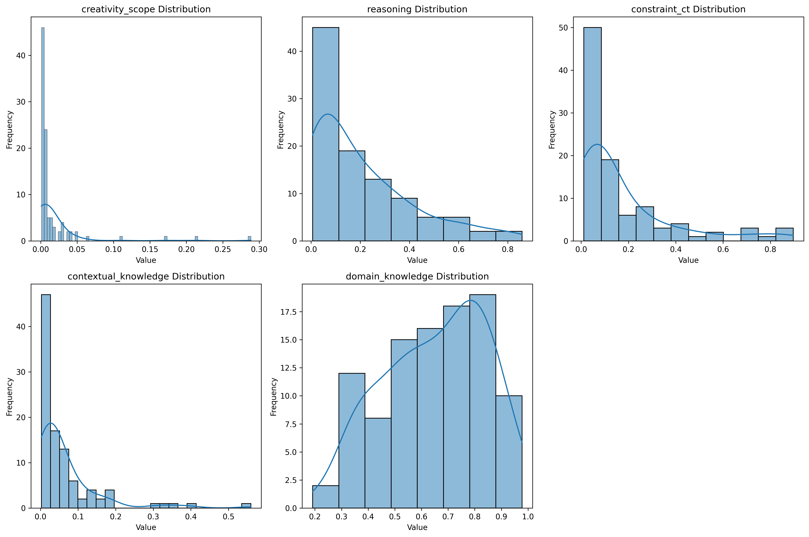
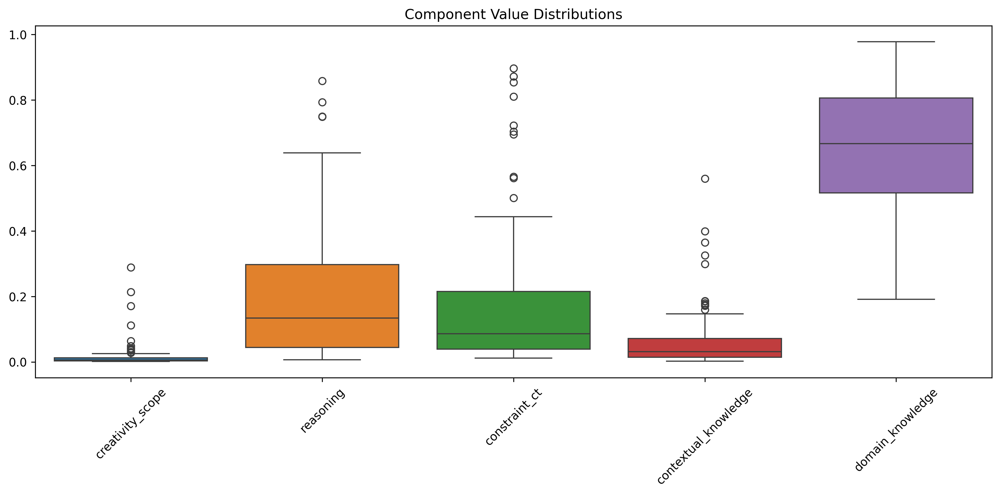
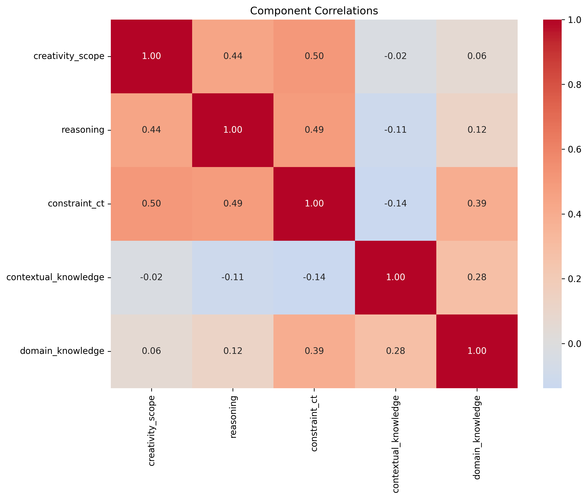
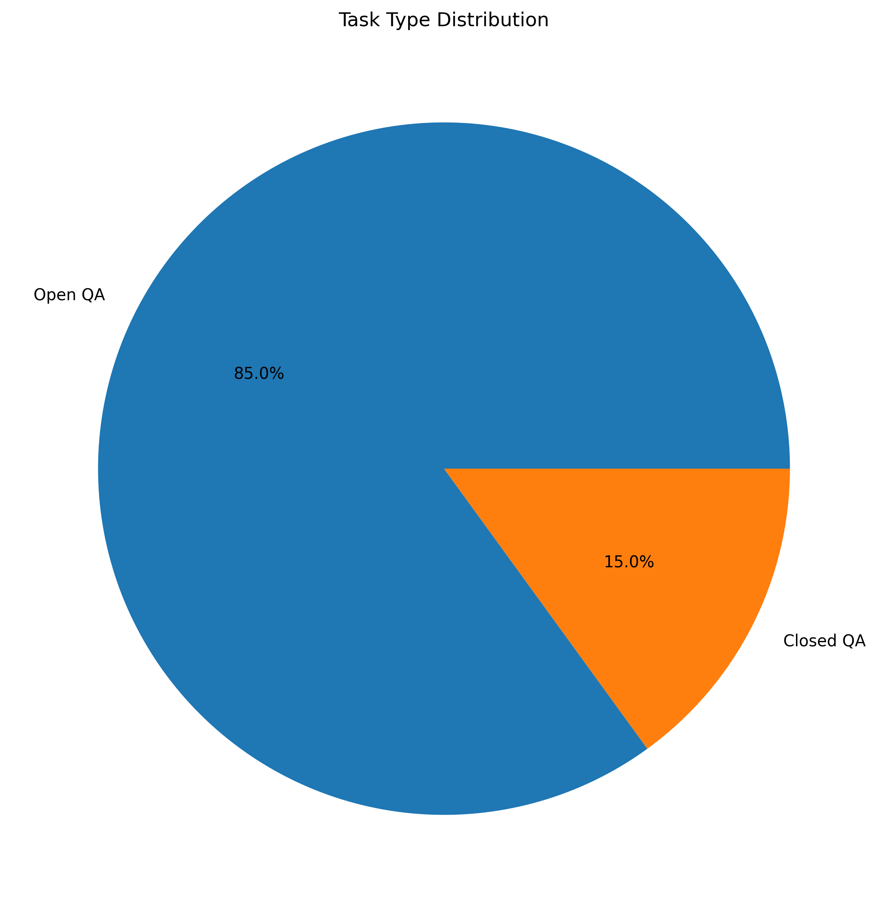
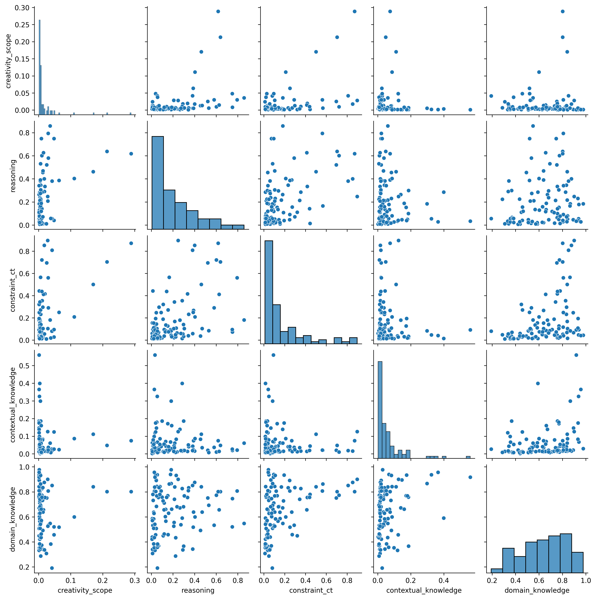

# ARC-Easy Vector Analysis Report (All Splits)

## 1. Dataset Overview

| Split | Number of Examples |
|-------|-------------------|
| Train | 2251 |
| Test | 2376 |
| Validation | 570 |
| Total | 100 |

## 2. Task Type Distribution

| Task Type | Count |
|-----------|-------|
| Open QA | 85 |
| Closed QA | 15 |

## 3. Descriptive Statistics

| Dimension | Min | Max | Mean | Std Dev | Q1 | Median | Q3 |
|-----------|-----|-----|------|---------|----|--------|----|
| creativity_scope | 0.001 | 0.288 | 0.017 | 0.040 | 0.003 | 0.005 | 0.012 |
| reasoning | 0.006 | 0.858 | 0.205 | 0.205 | 0.044 | 0.134 | 0.297 |
| constraint_ct | 0.011 | 0.896 | 0.175 | 0.212 | 0.039 | 0.086 | 0.215 |
| contextual_knowledge | 0.002 | 0.559 | 0.064 | 0.090 | 0.015 | 0.032 | 0.072 |
| domain_knowledge | 0.192 | 0.978 | 0.651 | 0.189 | 0.516 | 0.667 | 0.806 |

## 4. Summary Statistics

| Total Questions | Successful | Failed | Success Rate |
|----------------|------------|--------|--------------|
| 100 | 100 | 0 | 100.0% |

## 5. Key Findings

### Vector Analysis

- Mean values show the average level of each dimension across all questions

- Standard deviation indicates the variability in each dimension

- Range (max-min) shows the spread of values for each dimension

## 6. Visualizations

### Component Distributions

This plot shows the distribution of values for each component, helping identify patterns and outliers. The KDE (Kernel Density Estimation) curve shows the probability density of the values.

### Component Box Plots

Box plots provide a clear view of the statistical distribution of each component, including median (center line), quartiles (box edges), and outliers (points beyond whiskers).

### Component Correlations

This heatmap shows the correlation between different components, helping identify relationships between dimensions. Values range from -1 (perfect negative correlation) to 1 (perfect positive correlation).

### Task Type Distribution

Pie chart showing the distribution of different task types in the dataset, with percentage labels for each category.

### Component Scatter Matrix

This scatter plot matrix shows the relationships between all pairs of components, with histograms on the diagonal showing individual distributions.
