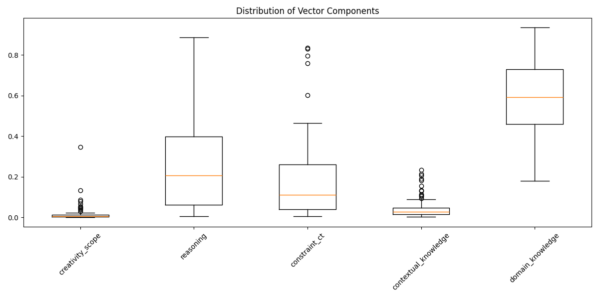
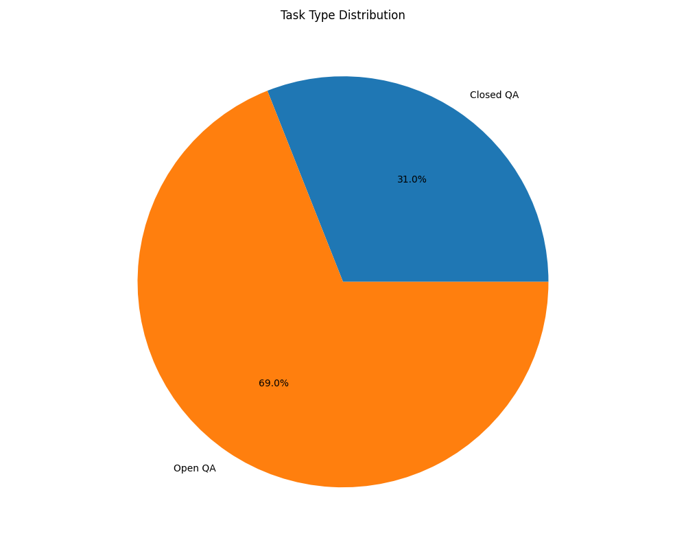
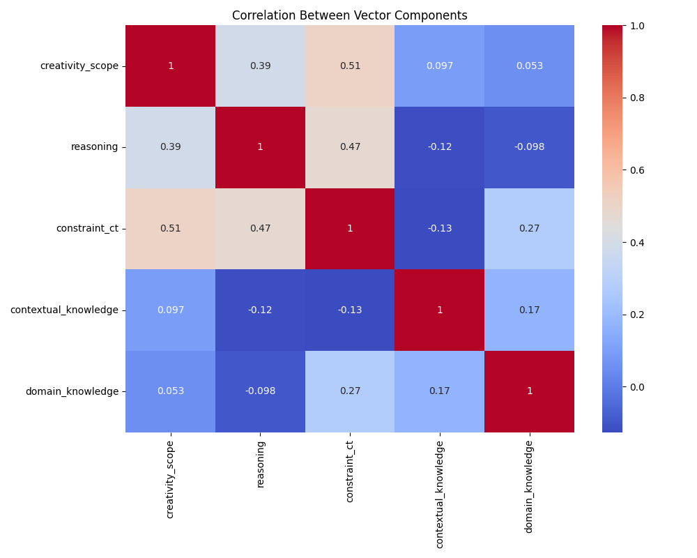
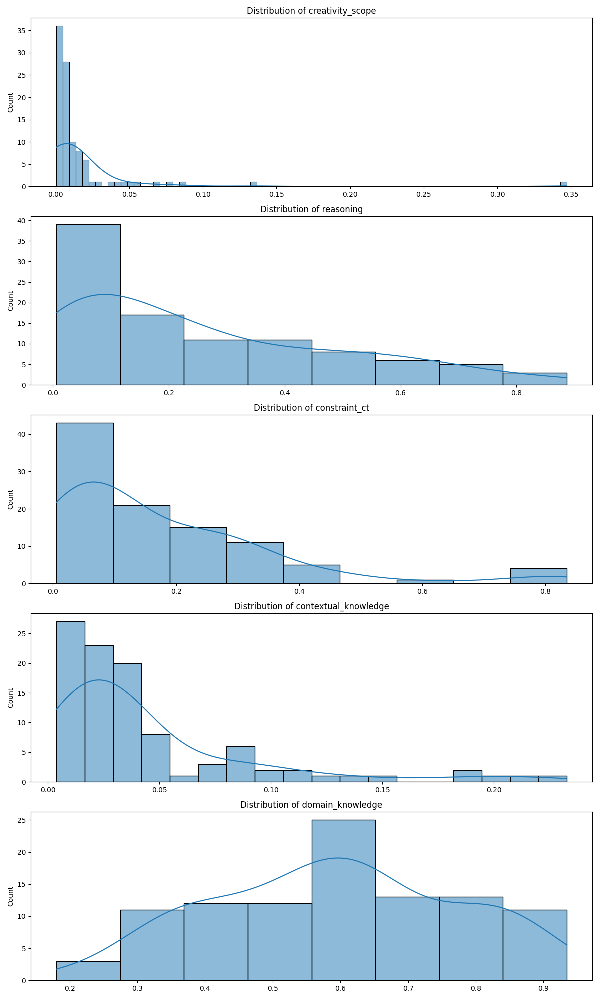

# ARC-Easy Vector Analysis Report (All Splits)

## 1. Dataset Overview

| Split | Number of Examples |
|-------|-------------------|
| Train | 1119 |
| Test | 1172 |
| Validation | 299 |
| Total | 100 |

## 2. Task Type Distribution

| Task Type | Count |
|-----------|-------|
| Closed QA | 31 |
| Open QA | 69 |

## 3. Descriptive Statistics

| Dimension | Min | Max | Mean | Std Dev | Q1 | Median | Q3 |
|-----------|-----|-----|------|---------|----|--------|----|
| creativity_scope | 0.000 | 0.347 | 0.016 | 0.039 | 0.004 | 0.007 | 0.014 |
| reasoning | 0.006 | 0.887 | 0.260 | 0.233 | 0.063 | 0.206 | 0.399 |
| constraint_ct | 0.005 | 0.835 | 0.176 | 0.182 | 0.040 | 0.111 | 0.261 |
| contextual_knowledge | 0.004 | 0.233 | 0.045 | 0.048 | 0.016 | 0.028 | 0.047 |
| domain_knowledge | 0.180 | 0.934 | 0.593 | 0.180 | 0.460 | 0.591 | 0.729 |

## 4. Summary Statistics

| Total Questions | Successful | Failed | Success Rate |
|----------------|------------|--------|--------------|
| 100 | 100 | 0 | 100.0% |

## 5. Key Findings

### Vector Analysis

- Mean values show the average level of each dimension across all questions

- Standard deviation indicates the variability in each dimension

- Range (max-min) shows the spread of values for each dimension

## 6. Visualizations

### Vector Components Distribution

### Task Type Distribution

### Component Correlations

### Component Distributions

