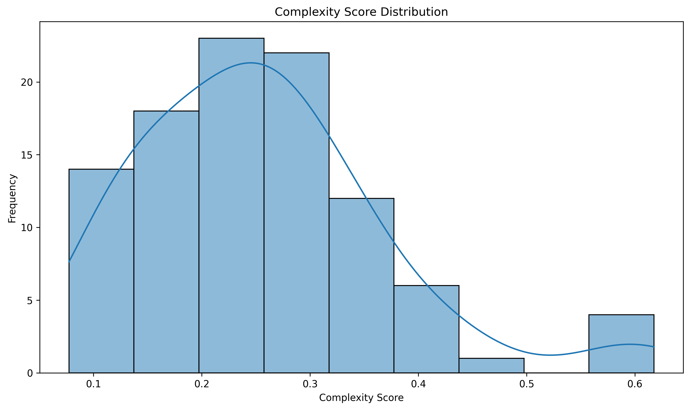
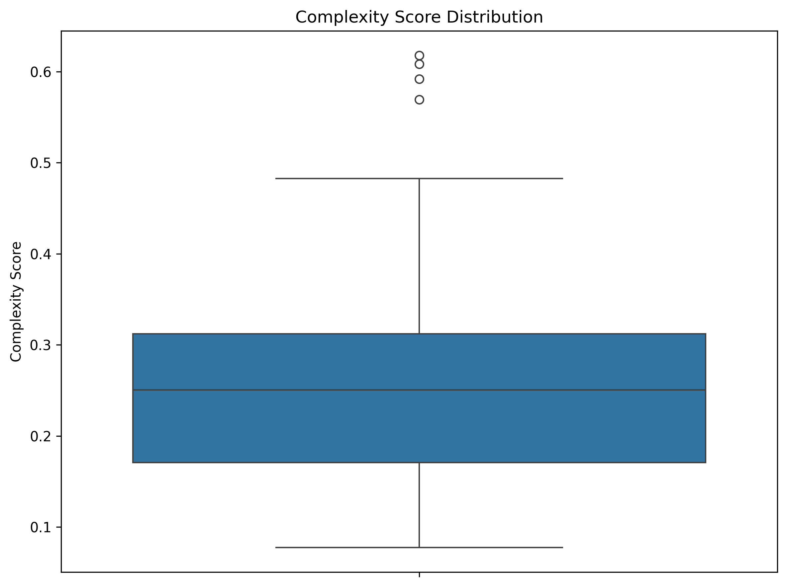
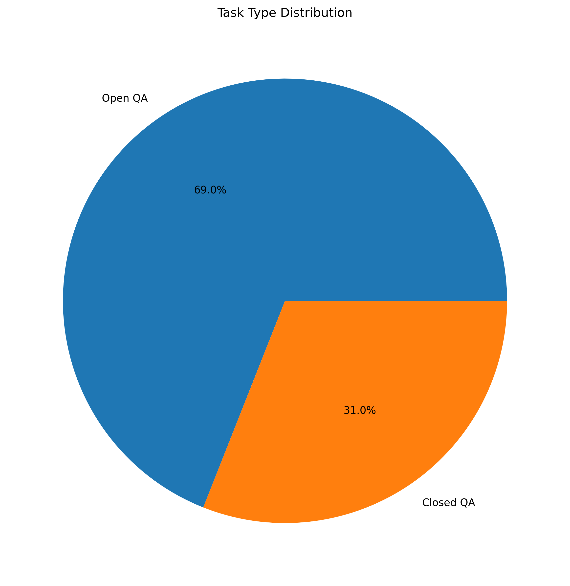
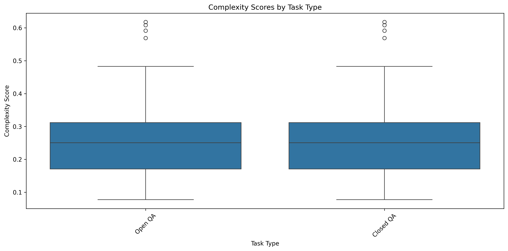

# ARC-Easy Complexity Score Analysis Report

## 1. Dataset Overview

| Split | Number of Examples |
|-------|-------------------|
| Train | 1119 |
| Test | 1172 |
| Validation | 299 |
| Total | 100 |

## 2. Task Type Distribution

| Task Type | Count |
|-----------|-------|
| Open QA | 69 |
| Closed QA | 31 |

## 3. Complexity Score Statistics

| Statistic | Value |
|-----------|-------|
| Min | 0.077 |
| Max | 0.618 |
| Mean | 0.254 |
| Std | 0.114 |
| Q1 | 0.171 |
| Median | 0.250 |
| Q3 | 0.312 |

## 4. Summary Statistics

| Total Questions | Successful | Failed | Success Rate |
|----------------|------------|--------|--------------|
| 100 | 100 | 0 | 100.0% |

## 5. Key Findings

### Complexity Score Analysis

- Mean complexity score shows the average difficulty level across all questions

- Standard deviation indicates the variability in complexity

- Range (max-min) shows the spread of complexity scores

## 6. Visualizations

### Complexity Score Distribution

This plot shows the distribution of complexity scores, helping identify patterns and outliers. The KDE (Kernel Density Estimation) curve shows the probability density of the scores.

### Complexity Score Box Plot

Box plot provides a clear view of the statistical distribution of complexity scores, including median (center line), quartiles (box edges), and outliers (points beyond whiskers).

### Task Type Distribution

Pie chart showing the distribution of different task types in the dataset, with percentage labels for each category.

### Complexity by Task Type

This box plot shows how complexity scores vary across different task types, helping identify which types of tasks tend to be more complex.
